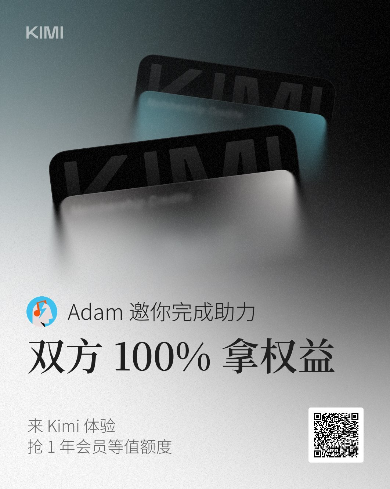

<!--
description: Kimi K3 邀请计划 - 注册即送免费额度。Kimi K3 是月之暗面于2026年7月发布的2.8万亿参数开源大模型，编程能力超越GPT-5.6和Claude Fable 5，支持100万token上下文，完全免费使用。通过邀请链接注册双方都得额度。
keywords: Kimi K3, 月之暗面, Moonshot AI, 开源模型, 免费AI, GPT替代, Claude替代, AI编程, 邀请注册, 国产大模型, 2.8万亿参数
-->

# Kimi K3 邀请计划 — 2.8万亿参数开源AI模型，注册免费使用 🔥

> **2026年7月16日发布** — Kimi K3 是目前全球参数规模最大的开源模型（2.8万亿参数），在 ProgramBench 编程测试中以 77.8 分超越 GPT-5.6 Sol 和 Claude Fable 5，支持 100 万 token 超长上下文和原生视觉理解，**且对个人用户完全免费**。通过下方邀请链接注册，双方均可获得额外使用额度。

---

## 🎁 Kimi 邀请注册送额度

通过邀请链接注册 Kimi 账号，你我都可获得额外免费额度。点击下方链接注册即自动带上邀请码，无需手动输入。

**[👉 立即免费注册 Kimi（30 秒完成）](https://kimi-bot.com/activities/zh-cn/viral-referral/share?scenario=invite&from=share_poster&invitation_code=FER37Z)**



---

## 🤯 Kimi K3 核心亮点

- **2.8 万亿参数，全球最大开源 AI 模型** — 新华社、多家官媒报道，马斯克公开点赞
- **编程能力超越 GPT-5.6 和 Claude Fable 5** — ProgramBench 评分 77.8 > 77.6 > 76.8，Coding 任务全球顶尖
- **100 万 token 上下文窗口** — 可一次处理整本书或整个代码仓库
- **原生视觉理解（Vision）** — 直接识别图片、图表、截图中的文字和逻辑
- **完全免费** — 注册即用，月之暗面出品，无需付费订阅
- **刚刚发布（2026 年 7 月 16 日）** — 最新的前沿 AI 技术，即刻体验

---

## 💻 开发者使用场景

### 编程开发
```python
# 输入需求，直接生成可运行代码
"写一个 FastAPI 的用户注册接口，带 JWT 认证和 SQLite 存储"
→ 秒出完整代码，连测试用例一起输出
```

### 论文阅读
```
上传 50 页 PDF → "总结论文核心方法、实验结论和局限性"
→ 耗时从 30 分钟缩短到 30 秒
```

### 数据分析
```
上传 CSV → "分析用户留存趋势，标注异常月份并给出原因"
→ 直接输出结论和可视化建议
```

### 网页与文档
```
粘贴链接 → "用中文总结文章要点，重点标注与主流观点的差异"
```

---

## 🏆 Kimi 会员邀请

如果你需要更高调用额度和优先排队，可以升级会员。邀请好友购买会员，双方各得额外会员时长。

**[👉 查看 Kimi 会员权益和邀请奖励](https://kimi-bot.com/activities/zh-cn/viral-referral/share?scenario=vip&from=share_poster&invitation_code=FER37Z)**

---

## 📌 链接汇总

| 类型 | 链接 |
|------|------|
| 🔗 Kimi 邀请注册（免费送额度） | [点击注册](https://kimi-bot.com/activities/zh-cn/viral-referral/share?scenario=invite&from=share_poster&invitation_code=FER37Z) |
| 💎 Kimi 会员邀请（双方得时长） | [查看详情](https://kimi-bot.com/activities/zh-cn/viral-referral/share?scenario=vip&from=share_poster&invitation_code=FER37Z) |
| 🌐 Kimi 官网 | [kimi.moonshot.cn](https://kimi.moonshot.cn) |
| 📖 月之暗面 Moonshot AI | [moonshot.cn](https://moonshot.cn) |

---

## 🔍 GitHub 搜索优化建议

> 💡 **请设置本仓库信息以提升搜索曝光：**
> - **Description（仓库描述）：** `Kimi K3 邀请注册 - 2.8万亿参数开源大模型，编程超越GPT-5.6，免费AI助手`
> - **Topics（话题标签）：** `kimi` `kimi-k3` `moonshot-ai` `ai` `llm` `open-source` `free-ai` `coding-assistant` `china-ai` `gpt-alternative` `claude-alternative` `大模型` `人工智能`

---

⭐ **如果觉得有用，请点 Star 支持，让更多人看到国产 AI 的力量。**
